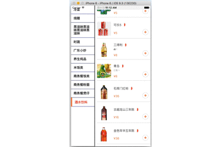

此demo算是自己学习React Natvie的一个小例子的。

因为开发过程中，经常需要使用两个ListView进行交互，如下图：

可以通过点击左边的菜品分类，切换到对应的section中，也可以通过滑动右边的菜品，同步更新到左边的分类。
主要思路是：

```
  componentDidUpdate() {
    let scrollResponder = this.refs.listView.getScrollResponder();
    scrollResponder.scrollResponderScrollTo({x: 0, y:this.pscroll(), animated: true});
  }

  shouldComponentUpdate(nextProps, nextState) {
    return nextProps.needUpdate;
  }

  pscroll() {
    console.log(this.props.section);
     var height = 0;
     for (var x in spuMenuItemList) {
       if (parseInt(x) < parseInt(this.props.section)) {
         height += spuMenuItemList[x].length * 100;
         height += 20;
       }
     }
     return height;
   }
   
    _onScroll(event: Object) {
      var scrollProperties = this.refs.listView.scrollProperties;
      // console.log(scrollProperties);
      // console.log(scrollProperties.offset);
      // console.log(this.props.section)

      if (this.props.fromLeftTouched) {
        return;
      }

      var height = 0;
      for (var x in spuMenuItemList) {
        height += spuMenuItemList[x].length * 100;
        height += 20;
        if (height > scrollProperties.offset) {
          if (x != this.state.currentIndex) {
            this.props.needChangeSection(parseInt(x));
            this.state.currentIndex = parseInt(x);
          }
          break;
        }
      }
    }
```